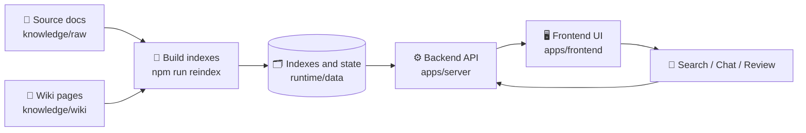

# Zigbee Wiki Assistant 📚💬

<p align="right">
  <a href="./README.md">
    
  </a>
</p>

A compact knowledge workbench for organizing Zigbee materials, building indexes, and using a web UI for search, Q&A, and review.

## ✨ Features

- 🔎 Search: build searchable indexes from wiki pages and source documents
- 💬 Chat: ask questions from a clean web interface
- 🧭 Evidence trace: inspect retrieved sources, citations, and context
- 🗂 Review and archive: manage research notes, review items, and archive records
- 🔐 Password gate: optional lightweight login protection

## 🧭 Flow



## 🧰 Stack

- Frontend: React, Vite, Tailwind CSS, Zustand
- Backend: Express, TypeScript
- Tools: TypeScript scripts for index generation and wiki health checks

## 🚀 Quick Start

Install dependencies:

```bash
npm ci
(cd apps/server && npm ci)
(cd apps/frontend && npm ci)
```

Prepare folders and environment file:

```bash
mkdir -p knowledge/raw knowledge/wiki runtime/data
cp .env.example .env.local
```

Then open `.env.local` and fill in your own `DEEPSEEK_API_KEY`.

Build indexes:

```bash
npm run reindex
```

Start the workbench:

```bash
npm run workbench:start
# Frontend: http://localhost:5173
# Backend:  http://localhost:3001
```

## 🔐 Optional Login

To enable login protection, update `.env.local`:

```bash
APP_AUTH_ENABLED="true"
APP_ACCESS_PASSWORD_HASH="scrypt:<salt_b64url>:<hash_b64url>"
SESSION_SECRET="replace-with-a-long-random-string"
```

## 📁 Layout

- `apps/server/`: backend API and data access
- `apps/frontend/`: frontend interface
- `tools/scripts/`: indexing and check scripts
- `knowledge/`: source materials and wiki pages
- `runtime/data/`: indexes, conversations, archives, and review data

## 🧪 Useful Commands

```bash
npm run reindex           # rebuild indexes and run checks
npm run workbench:status  # show running status
npm run workbench:stop    # stop local services

(cd apps/server && npm run build)
(cd apps/frontend && npm run build)
```
