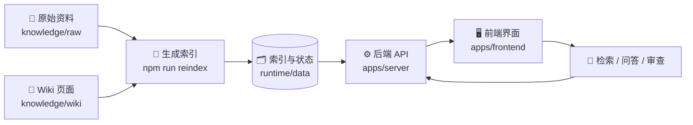

# Zigbee Wiki Assistant 📚💬

<p align="right">
  <a href="./README.en.md">
    
  </a>
</p>

一个用于整理 Zigbee 资料、生成索引，并通过网页界面进行检索、问答和审查的小型知识工作台。

## ✨ 功能

- 🔎 资料检索：从 Wiki 页面和原始文档生成可查询索引
- 💬 智能问答：在聊天界面中围绕资料提问
- 🧭 证据追踪：查看检索来源、引用和上下文
- 🗂 审查归档：整理研究过程、待复核条目和归档记录
- 🔐 访问口令：可按需开启简单登录保护

## 🧭 流程图



## 🧰 技术栈

- 前端：React、Vite、Tailwind CSS、Zustand
- 后端：Express、TypeScript
- 工具：TypeScript 脚本生成索引和检查 Wiki 健康状态

## 🚀 快速开始

安装依赖：

```bash
npm ci
(cd apps/server && npm ci)
(cd apps/frontend && npm ci)
```

准备目录和环境文件：

```bash
mkdir -p knowledge/raw knowledge/wiki runtime/data
cp .env.example .env.local
```

然后打开 `.env.local`，填写自己的 `DEEPSEEK_API_KEY`。

生成索引：

```bash
npm run reindex
```

启动工作台：

```bash
npm run workbench:start
# 前端：http://localhost:5173
# 后端：http://localhost:3001
```

## 🔐 可选登录保护

如需开启登录保护，在 `.env.local` 中改为：

```bash
APP_AUTH_ENABLED="true"
APP_ACCESS_PASSWORD_HASH="scrypt:<salt_b64url>:<hash_b64url>"
SESSION_SECRET="replace-with-a-long-random-string"
```

## 📁 目录

- `apps/server/`：后端 API 和数据读写
- `apps/frontend/`：前端界面
- `tools/scripts/`：索引生成和检查脚本
- `knowledge/`：资料和 Wiki 页面
- `runtime/data/`：索引、对话、归档和审查数据

## 🧪 常用命令

```bash
npm run reindex           # 重新生成索引并检查
npm run workbench:status  # 查看运行状态
npm run workbench:stop    # 停止本地服务

(cd apps/server && npm run build)
(cd apps/frontend && npm run build)
```
