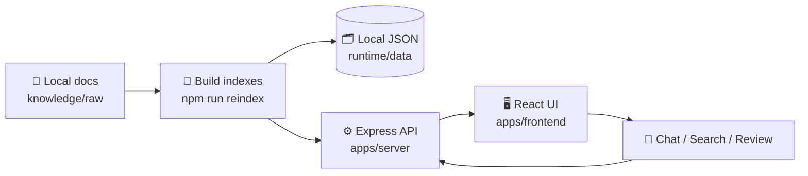

# Zigbee Wiki Chat Workbench 📚💬

> 中文：一个本地优先的 Zigbee 知识库聊天工作台，用 React 前端 + Express 后端浏览、检索和问答自己的 Wiki 资料。  
> English: A local-first Zigbee wiki chat workbench for browsing, searching, and chatting with your own knowledge base.

This public repo contains **application code only**. It intentionally does not include private knowledge files, API keys, environment files, or runtime JSON data.

本公开仓库只包含**应用代码**，不包含私有知识库资料、API Key、环境变量文件或运行数据 JSON。

## ✨ Features / 功能

- 🔎 **Knowledge search / 知识检索**: index local wiki pages and raw documents.
- 💬 **Chat UI / 聊天界面**: ChatGPT-style workspace for asking questions.
- 🧭 **Evidence workflow / 证据流程**: retrieval traces, review queues, and archives.
- 🔐 **Optional password gate / 可选访问口令**: enable with environment variables.
- 🧹 **Public-safe defaults / 默认适合公开仓库**: local data and secrets are ignored by Git.

## 🧭 Flow / 流程



## 🧰 Stack / 技术栈

- Frontend: React, Vite, Tailwind CSS, Zustand
- Backend: Express, TypeScript, local JSON storage
- Tools: TypeScript scripts for indexing and wiki health checks
- LLM: DeepSeek-compatible API key via environment variable

## 🚀 Quick Start / 快速开始

Install dependencies:

```bash
npm ci
(cd apps/server && npm ci)
(cd apps/frontend && npm ci)
```

Add your local-only folders and secrets:

```bash
mkdir -p knowledge/raw knowledge/wiki runtime/data
export DEEPSEEK_API_KEY="your-api-key"
```

Optional password protection:

```bash
export APP_AUTH_ENABLED=true
export APP_ACCESS_PASSWORD_HASH="scrypt:<salt_b64url>:<hash_b64url>"
export SESSION_SECRET="replace-with-a-long-random-string"
```

Start the workbench:

```bash
npm run workbench:start
# Frontend: http://localhost:5173
# Backend:  http://localhost:3001
```

Build both apps:

```bash
(cd apps/server && npm run build)
(cd apps/frontend && npm run build)
```

## 📁 Layout / 目录

- `apps/server/`: Express API and local data access.
- `apps/frontend/`: React UI.
- `tools/scripts/`: indexing and health-check scripts.
- `knowledge/`: your local corpus, ignored by Git.
- `runtime/data/`: generated indexes and app state, ignored except `.gitkeep`.
- `.workbench/`: local process files and logs, ignored by Git.

## 🧪 Useful Commands / 常用命令

```bash
npm run reindex           # rebuild wiki/source indexes and run checks
npm run workbench:status  # show local server/frontend status
npm run workbench:stop    # stop local processes
```

## 🔒 Public Repo Safety / 公开仓库安全

The repository is configured to keep these out of Git:

- `.env*` files, except a future `.env.example`
- `knowledge/` private corpus
- `runtime/data/*.json` runtime data
- `.workbench/` logs and pid files
- `node_modules/`, `dist/`, logs, and TypeScript build info

Do not commit real API keys, passwords, generated runtime data, or private documents.

请不要提交真实 API Key、访问口令、运行数据或私有文档。
